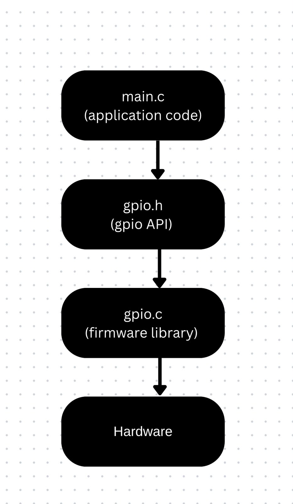
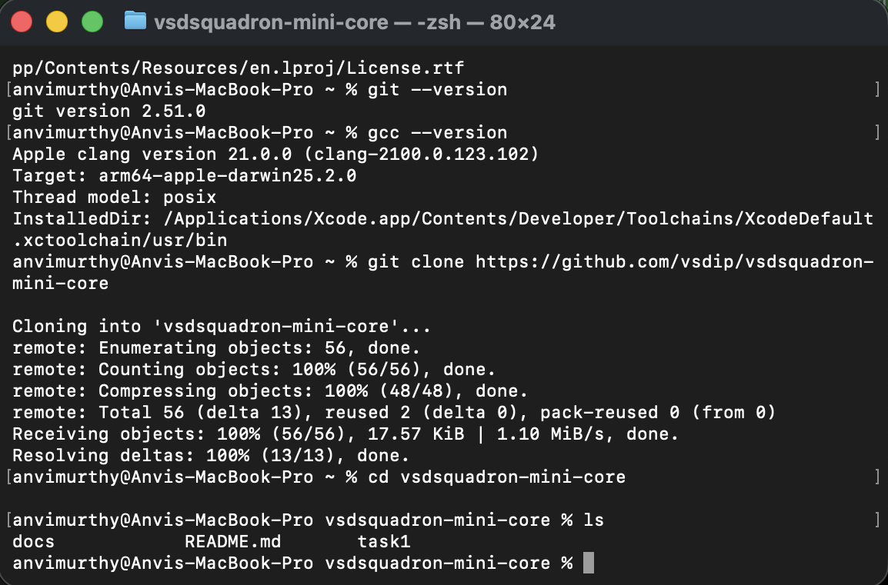
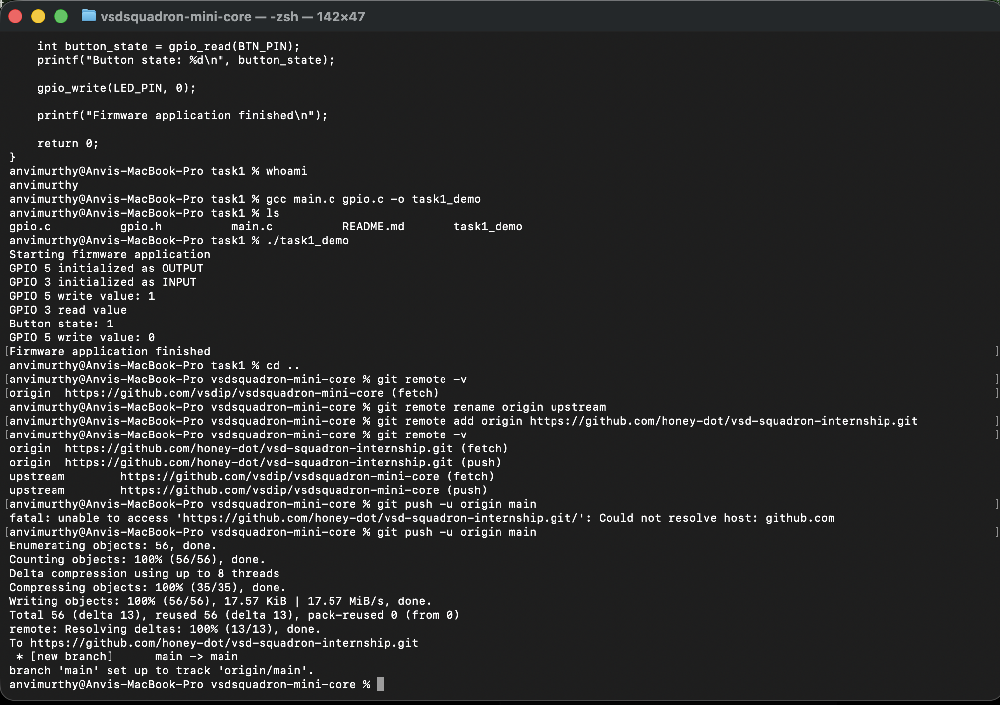
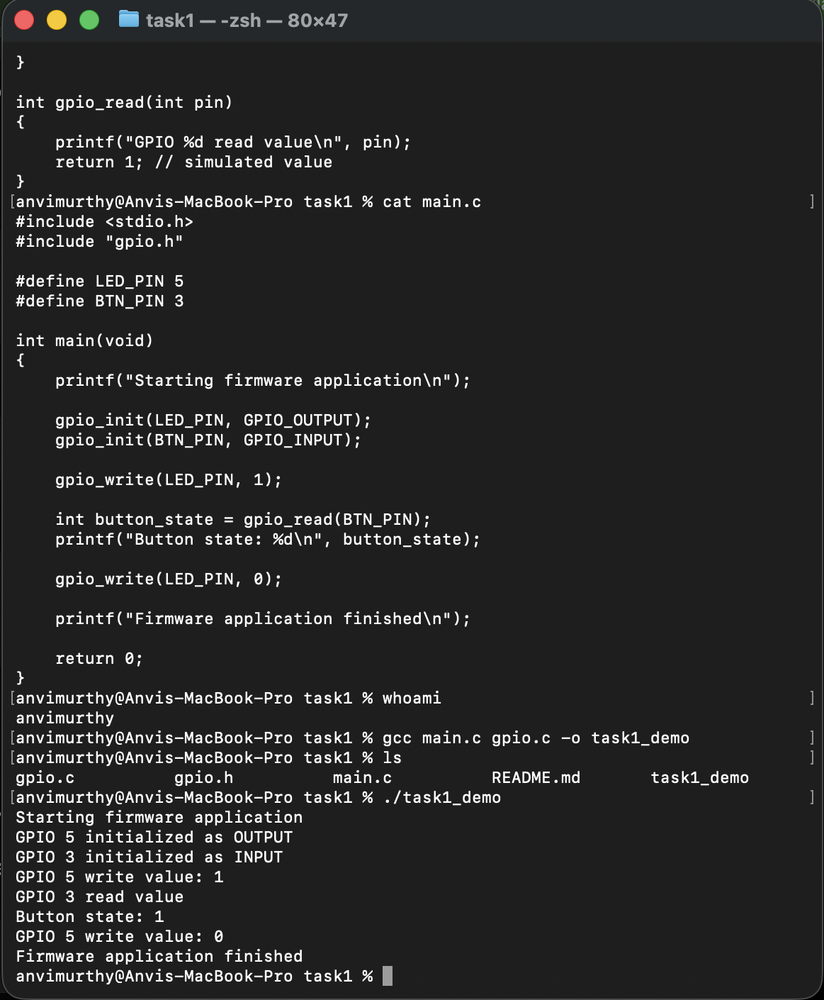
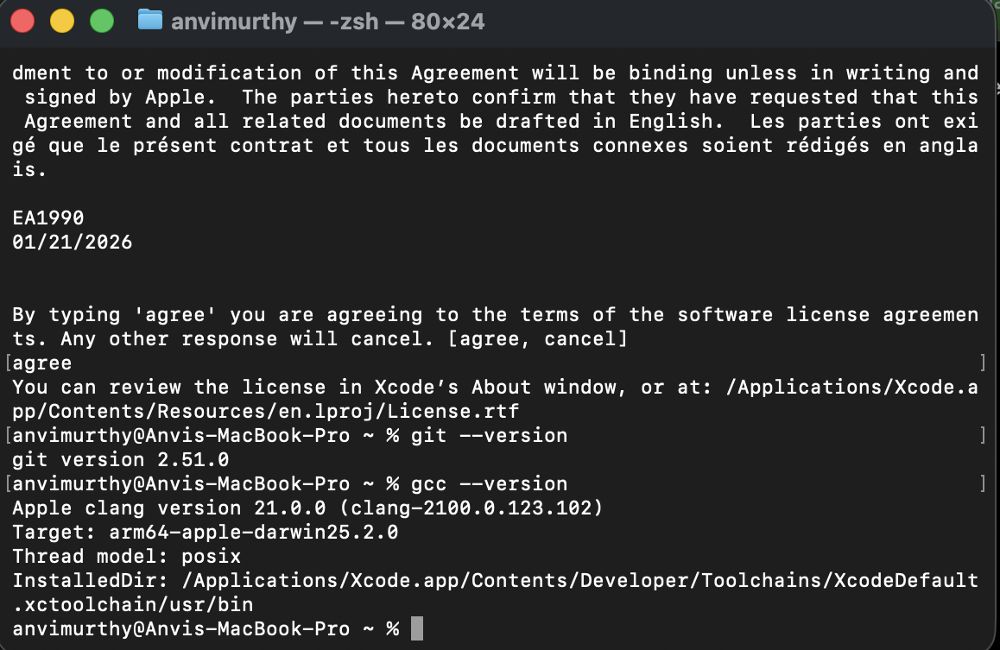

## DE:
    macOS
    Git 2.51.0
    Apple Clang 21.0.0 (C compiler)

## A short written explanation WITH COMPULSORY IMAGES for each of below item (1–2 pages or Markdown):
    What is a firmware library?
    Why APIs are important in embedded systems?
    What was understood from the lab code?

### What is a firmware library?
    Firmware is a type of software run inside an embedded system and interacts with the hardware. It's the intermediary between application-level code(here, main.c) and the actual hardware components(here, GPIO pins).
    Firmware library is a reusable set of low-level code. It basically hides the internal working from the main.c. Here, the firmware library contains gpio.c and gpio.h.
    gpio.h : declares the API
    gpio.c : contains the implementation

### Why are APIs important in embedded systems?
    API: Application Programming Interrface
    It defines "how" the app-code will communicate with a firmware library.
    functions:
        void gpio_init(int pin, int direction);
        void gpio_wriite(int pin, int value);
        int gpio_read(int pin);
    Each function has its own parameter requirement or the return value thats demonstrated here.
    APIs hide the register level complexity. It increases code readability.

### What was understoof from the lab code?
    The task1 folder contains 4 files: 
        gpio.h
        gpio.c
        main.c
        README.md
    **GPIO.H**: header file that defines the interface. It defines 2 GPIO directions:
        #define GPIO_output 1
        #define GPIO_input 0
    **GPIO.C**: implmentation of the functions called in gpio.h
    **MAIN.C**: LED and buttons pins defined. 

## A screenshot (with your username clearly displayed on terminal) showing:
    Successful compilation and Program Output

### Verification of Git and GCC installation on macOS.

### 