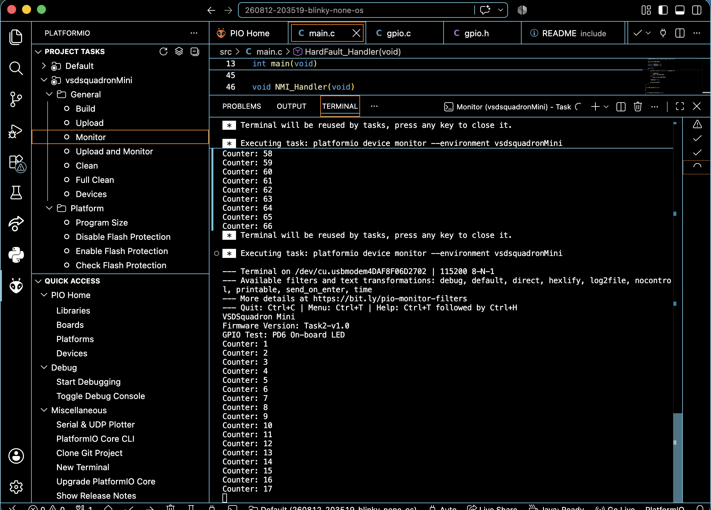

# Task 2 - Evidence

## 1. UART Evidence

### UART Output

The VSDSquadron Mini was successfully flashed with the Task 2 firmware and
UART communication was verified using the PlatformIO Serial Monitor.

The UART was configured at **115200 baud**.

The firmware prints the board name, firmware version, GPIO being tested,
and a continuously increasing counter.

### UART Screenshot

### UART Video

### Verification

The continuously increasing counter confirms that the firmware is
executing continuously on the microcontroller and that serial
communication between the board and the computer is working correctly.

---

## 2. GPIO Evidence

### GPIO Pin Mapping

The GPIO used for the hardware demonstration is the onboard user LED.

- **Physical pin label:** PD6
- **Firmware GPIO number:** `GPIO_Pin_6`
- **GPIO port:** `GPIOD`
- **Hardware:** Onboard user LED

The pin mapping was verified using the VSDSquadron Mini board
documentation.

### Physical Board

### Verification
The firmware initializes PD6 as a push-pull output through the GPIO API.
The application then alternates between `gpio_set()` and `gpio_clear()`
with a one-second delay.

The onboard LED was observed blinking on the physical board, confirming
that the firmware GPIO configuration and the physical GPIO mapping were
correct.

---

## 3. Firmware and Build Evidence
The firmware was successfully compiled and uploaded to the physical
VSDSquadron Mini.

The final firmware uses a separate GPIO abstraction layer consisting of:

- `gpio.h` — GPIO API declarations
- `gpio.c` — GPIO API implementation
- `main.c` — application logic

The application does not directly perform GPIO operations. Instead,
`main.c` calls the GPIO API functions.

The PlatformIO build completed successfully and generated the firmware
binary.

Task 2 Result:
    The VSDSquadron Mini was successfully brought up and programmed.
    The implementation demonstrated:
        Successful PlatformIO project setup
        Successful firmware upload
        Continuous UART counter output
        Correct physical GPIO identification
        GPIO abstraction using gpio.c and gpio.h
        Physical LED blinking on the board
